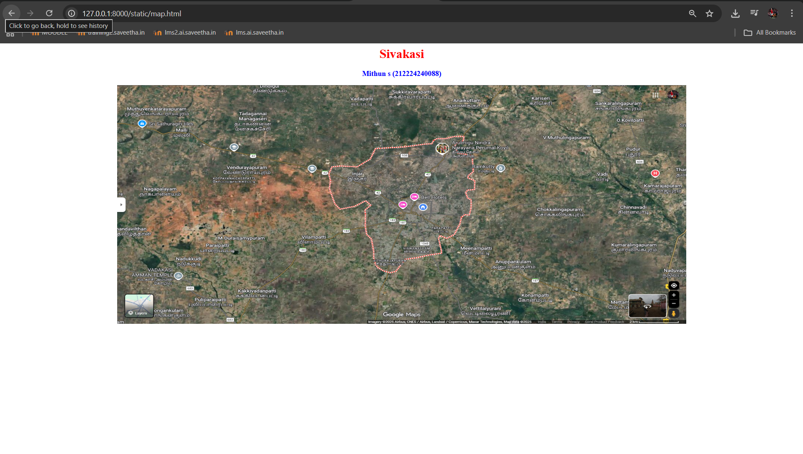
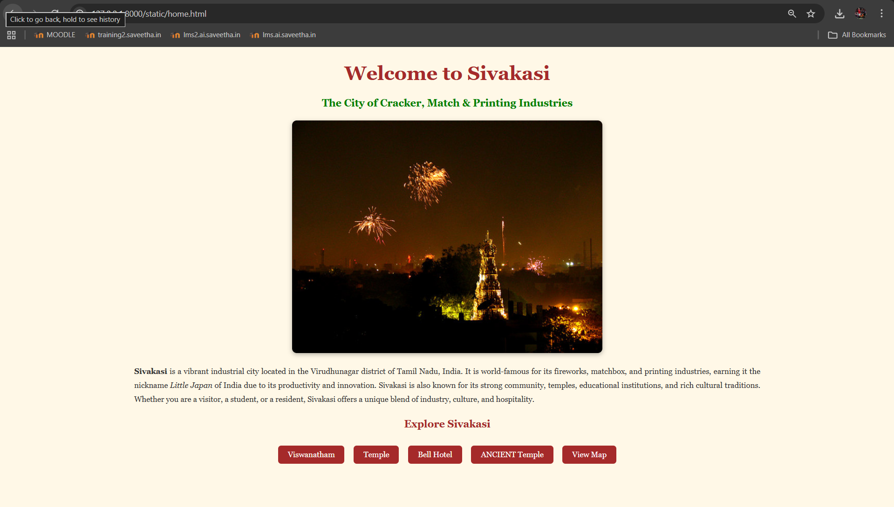
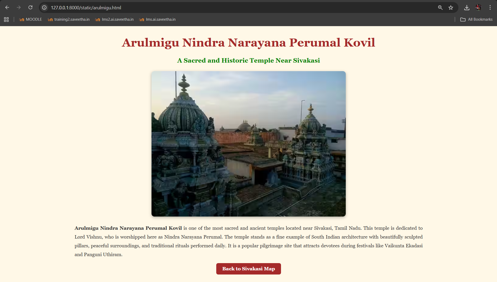
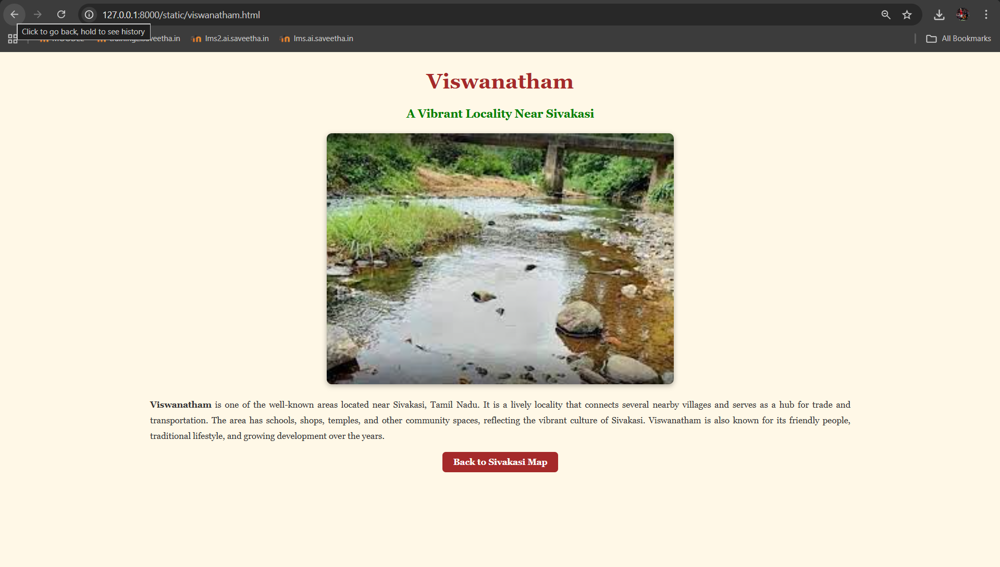
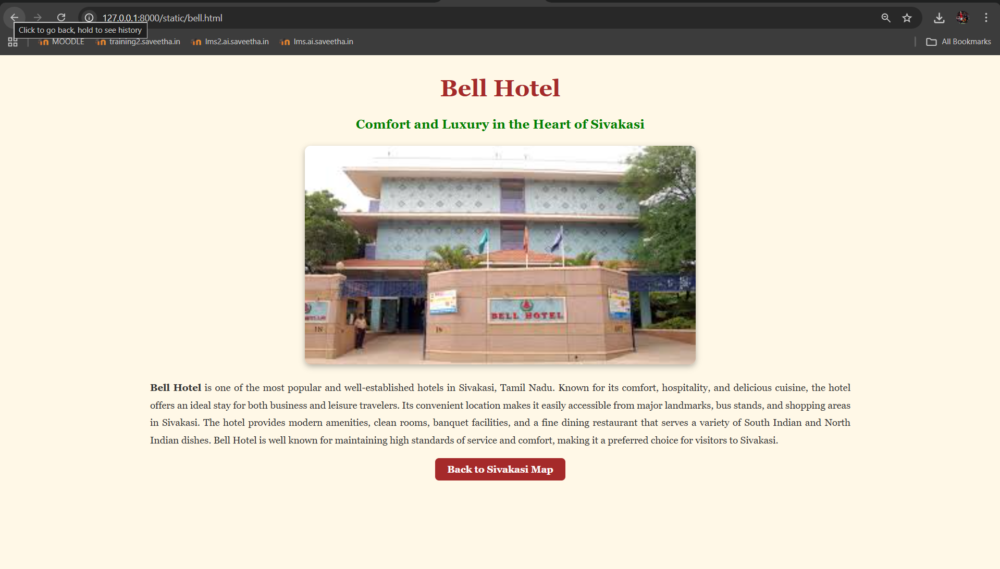
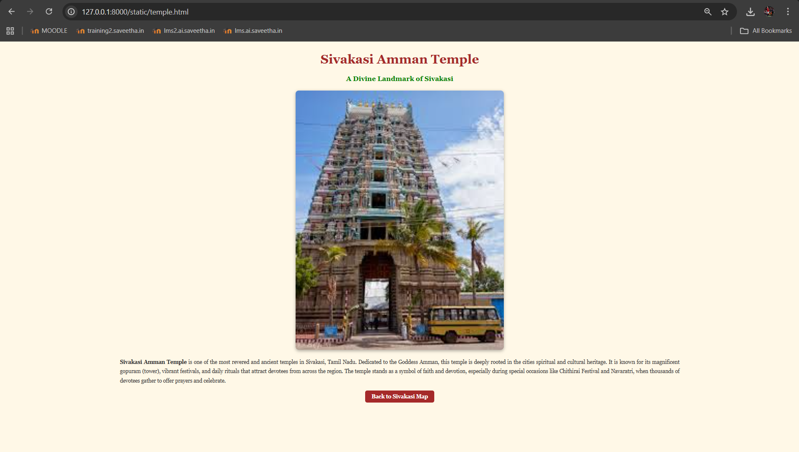

# Ex04 Places Around Me
## Date: 16/10/2025

## AIM
To develop a website to display details about the places around my house.

## DESIGN STEPS

### STEP 1
Create a Django admin interface.

### STEP 2
Download your city map from Google.

### STEP 3
Using ```<map>``` tag name the map.

### STEP 4
Create clickable regions in the image using ```<area>``` tag.

### STEP 5
Write HTML programs for all the regions identified.

### STEP 6
Execute the programs and publish them.

## CODE
```
## Map.html

<html>
<head>
<title>My City</title>
</head>
<body>
<h1 align="center">
<font color="red"><b>Sivakasi</b></font>
</h1>
<h3 align="center">
<font color="blue"><b>Mithun s (212224240088)</b></font>
</h3>
<center>

<map name="MyCity">
<area shape="rect" coords="700,250,850,400" href="home.html" title="My Home Town">
<area shape="circle" coords="780,320,40" href="arulmigu_nindra_narayana.html" title="Arulmigu Nindra Narayana Perumal Kovil">
<area shape="circle" coords="670,360,35" href="bell_hotels.html" title="Bell Hotels">
<area shape="circle" coords="850,420,35" href="viswanatham.html" title="Viswanatham">
<area shape="circle" coords="750,470,35" href="sivakasi_temple.html" title="Sivakasi Amman Temple">
</map>
</center>
</body>
</html>

```
```
## Home.html

<html>
<head>
<title>Welcome to Sivakasi</title>

<style>
  body {
    background-color: #FFF8E7;
    font-family: "Georgia", serif;
    text-align: center;
    margin: 0;
    padding: 0;
  }

  h1 {
    color: brown;
    font-size: 50px;
    margin-top: 40px;
  }

  h3 {
    color: green;
    font-size: 26px;
    margin-bottom: 30px;
  }

  img {
    border-radius: 12px;
    width: 70%;
    max-width: 800px;
    height: auto;
    box-shadow: 0 4px 12px rgba(0, 0, 0, 0.3);
  }

  p {
    width: 70%;
    margin: 30px auto;
    font-size: 20px;
    line-height: 1.8;
    color: #333;
    text-align: justify;
  }

  .links a {
    text-decoration: none;
    background-color: brown;
    color: white;
    padding: 12px 25px;
    border-radius: 8px;
    font-size: 20px;
    margin: 10px;
    display: inline-block;
    transition: 0.3s;
  }

  .links a:hover {
    background-color: #A52A2A;
    transform: scale(1.05);
  }
</style>

</head>
<body>

<h1><b>Welcome to Sivakasi</b></h1>
<h3><b>The City of Cracker, Match & Printing Industries</b></h3>

<center>
  
</center>

<p>
<b>Sivakasi</b> is a vibrant industrial city located in the Virudhunagar district of Tamil Nadu, India. 
It is world-famous for its fireworks, matchbox, and printing industries, earning it the nickname 
<i>Little Japan</i> of India due to its productivity and innovation. 
Sivakasi is also known for its strong community, temples, educational institutions, and rich cultural traditions. 
Whether you are a visitor, a student, or a resident, Sivakasi offers a unique blend of industry, culture, and hospitality.
</p>

<h3 style="color:brown;">Explore Sivakasi</h3>

<div class="links">
  <a href="viswanatham.html">Viswanatham</a>
  <a href="arulmigu.html">Temple</a>
  <a href="bell.html">Bell Hotel</a>
  <a href="temple.html"> ANCIENT Temple</a>
  <a href="map.html">View Map</a>
</div>

</body>
</html>
```
```
## Arulmigu.html

<html>
<head>
<title>Arulmigu Nindra Narayana Perumal Kovil - Sivakasi</title>

<style>
  body {
    background-color: #FFF8E7;
    font-family: "Georgia", serif;
    text-align: center;
    margin: 0;
    padding: 0;
  }

  h1 {
    color: brown;
    font-size: 48px;
    margin-top: 40px;
  }

  h3 {
    color: green;
    font-size: 26px;
    margin-bottom: 30px;
  }

  img {
    border-radius: 12px;
    width: 70%;
    max-width: 800px;
    height: auto;
    box-shadow: 0 4px 12px rgba(0, 0, 0, 0.3);
  }

  p {
    width: 70%;
    margin: 30px auto;
    font-size: 20px;
    line-height: 1.8;
    color: #333;
    text-align: justify;
  }

  a {
    text-decoration: none;
    background-color: brown;
    color: white;
    padding: 12px 25px;
    border-radius: 8px;
    font-size: 20px;
    transition: 0.3s;
  }

  a:hover {
    background-color: #A52A2A;
    transform: scale(1.05);
  }
</style>

</head>
<body>

<h1><b>Arulmigu Nindra Narayana Perumal Kovil</b></h1>
<h3><b>A Sacred and Historic Temple Near Sivakasi</b></h3>

<center>
  
</center>

<p>
<b>Arulmigu Nindra Narayana Perumal Kovil</b> is one of the most sacred and ancient temples located near Sivakasi, Tamil Nadu. 
This temple is dedicated to Lord Vishnu, who is worshipped here as Nindra Narayana Perumal. 
The temple stands as a fine example of South Indian architecture with beautifully sculpted pillars, peaceful surroundings, and traditional rituals performed daily. 
It is a popular pilgrimage site that attracts devotees during festivals like Vaikunta Ekadasi and Panguni Uthiram.
</p>

<h3>
  <a href="map.html">Back to Sivakasi Map</a>
</h3>

</body>
</html>
```
```
## Bell.html

<html>
<head>
<title>Bell Hotel - Sivakasi</title>

<style>
  body {
    background-color: #FFF8E7;
    font-family: "Georgia", serif;
    text-align: center;
    margin: 0;
    padding: 0;
  }

  h1 {
    color: brown;
    font-size: 48px;
    margin-top: 40px;
  }

  h3 {
    color: green;
    font-size: 26px;
    margin-bottom: 30px;
  }

  img {
    border-radius: 12px;
    width: 70%;
    max-width: 800px;
    height: auto;
    box-shadow: 0 4px 12px rgba(0, 0, 0, 0.3);
  }

  p {
    width: 70%;
    margin: 30px auto;
    font-size: 20px;
    line-height: 1.8;
    color: #333;
    text-align: justify;
  }

  a {
    text-decoration: none;
    background-color: brown;
    color: white;
    padding: 12px 25px;
    border-radius: 8px;
    font-size: 20px;
    transition: 0.3s;
  }

  a:hover {
    background-color: #A52A2A;
    transform: scale(1.05);
  }
</style>

</head>
<body>

<h1><b>Bell Hotel</b></h1>
<h3><b>Comfort and Luxury in the Heart of Sivakasi</b></h3>

<center>
  
</center>

<p>
<b>Bell Hotel</b> is one of the most popular and well-established hotels in Sivakasi, Tamil Nadu. 
Known for its comfort, hospitality, and delicious cuisine, the hotel offers an ideal stay for both business and leisure travelers. 
Its convenient location makes it easily accessible from major landmarks, bus stands, and shopping areas in Sivakasi. 
The hotel provides modern amenities, clean rooms, banquet facilities, and a fine dining restaurant that serves a variety of South Indian and North Indian dishes. 
Bell Hotel is well known for maintaining high standards of service and comfort, making it a preferred choice for visitors to Sivakasi.
</p>

<h3>
  <a href="map.html">Back to Sivakasi Map</a>
</h3>

</body>
</html>
```
```
## Temple.html

<html>
<head>
<title>Sivakasi Amman Temple - Sivakasi</title>

<style>
  body {
    background-color: #FFF8E7;
    font-family: "Georgia", serif;
    text-align: center;
    margin: 0;
    padding: 0;
  }

  h1 {
    color: brown;
    font-size: 48px;
    margin-top: 40px;
  }

  h3 {
    color: green;
    font-size: 26px;
    margin-bottom: 30px;
  }

  img {
    border-radius: 12px;
    width: 70%;
    max-width: 800px;
    height: auto;
    box-shadow: 0 4px 12px rgba(0, 0, 0, 0.3);
  }

  p {
    width: 70%;
    margin: 30px auto;
    font-size: 20px;
    line-height: 1.8;
    color: #333;
    text-align: justify;
  }

  a {
    text-decoration: none;
    background-color: brown;
    color: white;
    padding: 12px 25px;
    border-radius: 8px;
    font-size: 20px;
    transition: 0.3s;
  }

  a:hover {
    background-color: #A52A2A;
    transform: scale(1.05);
  }
</style>

</head>
<body>

<h1><b>Sivakasi Amman Temple</b></h1>
<h3><b>A Divine Landmark of Sivakasi</b></h3>

<center>
  
</center>

<p>
<b>Sivakasi Amman Temple</b> is one of the most revered and ancient temples in Sivakasi, Tamil Nadu. 
Dedicated to the Goddess Amman, this temple is deeply rooted in the cities spiritual and cultural heritage. 
It is known for its magnificent gopuram (tower), vibrant festivals, and daily rituals that attract devotees from across the region. 
The temple stands as a symbol of faith and devotion, especially during special occasions like Chithirai Festival and Navaratri, when thousands of devotees gather to offer prayers and celebrate.
</p>

<h3>
  <a href="map.html">Back to Sivakasi Map</a>
</h3>

</body>
</html>
```
```
## Viswanatham.html

<html>
<head>
<title>Viswanatham - Sivakasi</title>

<style>
  body {
    background-color: #FFF8E7;
    font-family: "Georgia", serif;
    text-align: center;
    margin: 0;
    padding: 0;
  }

  h1 {
    color: brown;
    font-size: 48px;
    margin-top: 40px;
  }

  h3 {
    color: green;
    font-size: 26px;
    margin-bottom: 30px;
  }

  img {
    border-radius: 12px;
    width: 70%;
    max-width: 800px;
    height: auto;
    box-shadow: 0 4px 12px rgba(0, 0, 0, 0.3);
  }

  p {
    width: 70%;
    margin: 30px auto;
    font-size: 20px;
    line-height: 1.8;
    color: #333;
    text-align: justify;
  }

  a {
    text-decoration: none;
    background-color: brown;
    color: white;
    padding: 12px 25px;
    border-radius: 8px;
    font-size: 20px;
    transition: 0.3s;
  }

  a:hover {
    background-color: #A52A2A;
    transform: scale(1.05);
  }
</style>

</head>
<body>

<h1><b>Viswanatham</b></h1>
<h3><b>A Vibrant Locality Near Sivakasi</b></h3>

<center>
  
</center>

<p>
<b>Viswanatham</b> is one of the well-known areas located near Sivakasi, Tamil Nadu. 
It is a lively locality that connects several nearby villages and serves as a hub for trade and transportation. 
The area has schools, shops, temples, and other community spaces, reflecting the vibrant culture of Sivakasi. 
Viswanatham is also known for its friendly people, traditional lifestyle, and growing development over the years.
</p>

<h3>
  <a href="map.html">Back to Sivakasi Map</a>
</h3>

</body>
</html>

```
## OUTPUT






## RESULT
The program for implementing image maps using HTML is executed successfully.
